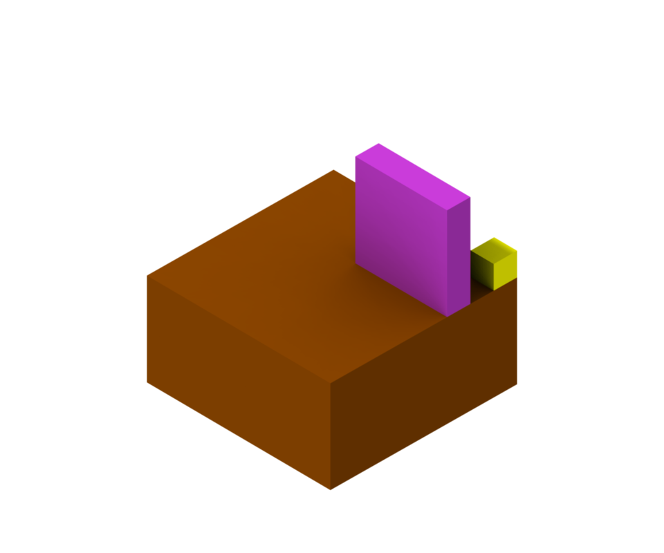
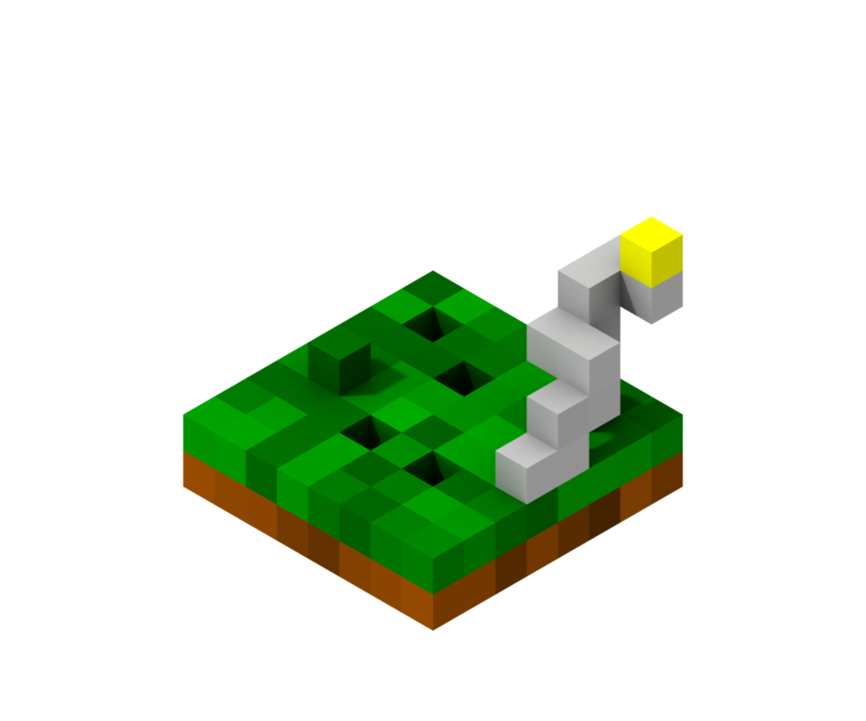
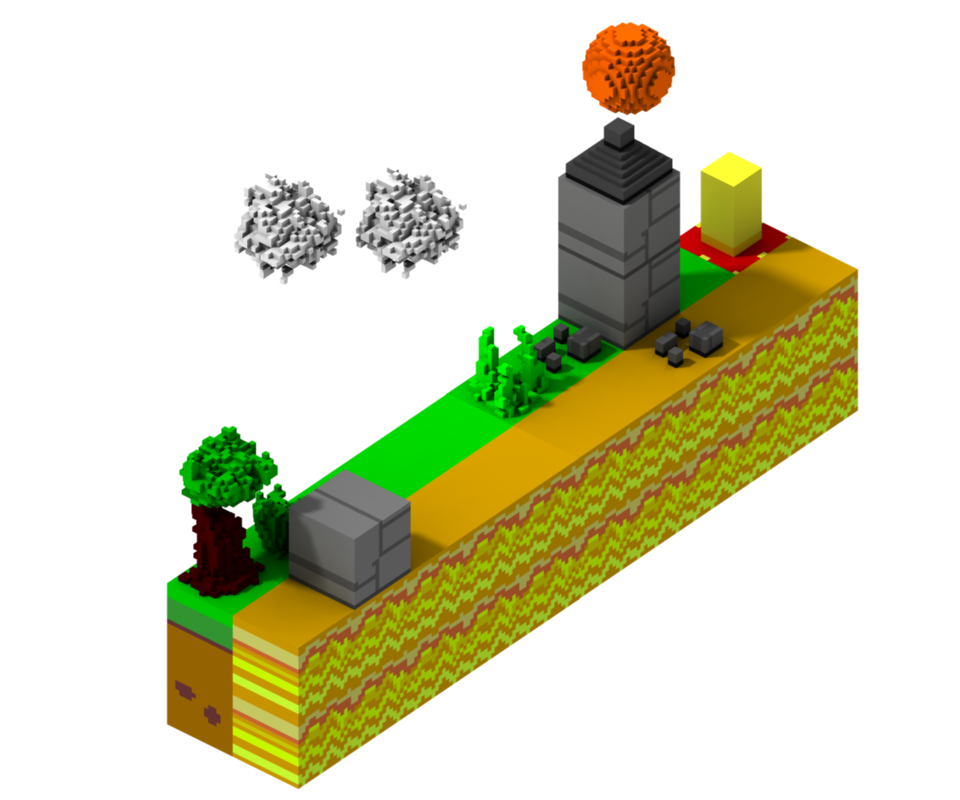

Use troxel here to make maps: https://cakenggt.github.io/Troxel

* All empty blocks will be made into air.
* `Type`: `solid` means solid, anything else means it is a non-solid block.
* `Specular`: `rough` means not goal, anything else means it is a goal block.
* Export as Link, make sure `resize to bounding box` is unchecked,then paste into `map.troxelLink` as a string

x and z 0, 0 is the outlined block in the back right corner. x increases to the left, z increases to the right

Map Model
=====
Wrap in a call to `setGameVarForMap`
* playerPos:
  * x: x position (in blocks)
  * y: y position (in blocks)
  * z: z position (in blocks)
  * deg: initial degree facing
  * vel: velocity (vector)
* playerWidth: width of the player (in blocks) (should be multiplied by scale)
* scale: scale of the blocks (used for velocity and gravity calculations)
* climbableBlocks: number of blocks that are auto-climbable
* animation: function called once per frame to animate the map. Takes `DOMHighResTimeStamp` parameter
* troxelLink: pasted troxel link for map

Maps
=====

Map1
---

Map2
---

Map3
---

