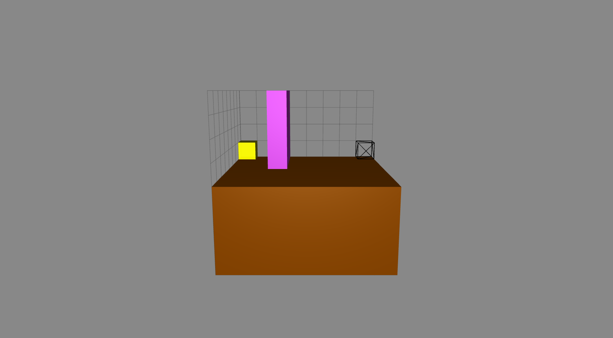

Example image for troxel

Use troxel here: https://cakenggt.github.io/Troxel

* All empty blocks will be made into air.
* Type: solid means solid, anything else means it is a non-solid block.
* Specular: rough means not goal, anything else means it is a goal block.
* Export as Link, then paste into troxelLink

x and z 0, 0 is in the back right corner.
